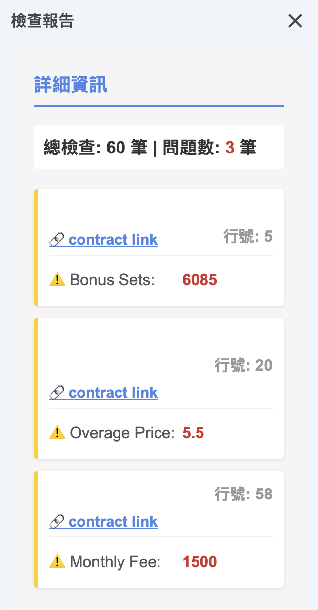

# Automated Billing Verifier

## Executive Summary
This GAS-powered Verification Engine safeguards financial integrity through a dual-layer audit system: the checkTPR engine ensures CSM database synchronization, 
while the checkCB module automates complex RSV/Deposit billing validation.

## Project Structure
1. [interface.js](./interface.js) - UI initialization and custom menu management.
2. [checkTPR.js](./checkTPR.js) - Triple Check engine: Cross-verifies contract details with historical CSM records.
3. [ReportDialog.html](./ReportDialog.html) - Interactive HTML5 sidebar for discrepancy visualization and navigation.
4. [checkCB.js](./checkCB.js) - Billing & Plan Auditor: Validates billing rows against master Plan tables (RSV/Deposit).

## UI Preview & Interactive Features
* **Hierarchical View**: Each record is grouped by **Restaurant Name** (displayed as the header of each card for quick identification).
* **Status Indicators**: Uses color-coded borders (Yellow/Red) to highlight discrepancies.
* **Direct Navigation**: Clicking any card will trigger `jumpToRow()` to locate the data in the spreadsheet.
* *(Note: Restaurant names are hidden in the preview images below due to privacy policies.)*

  
  &nbsp;&nbsp;&nbsp;&nbsp;
  

  <em>Left: Discrepancy Alert Mode | Right: Success Confirmation Mode</em>

## Core Engine Logic
* **Data Integrity Sync (`checkTPR`)**: Ensures the "Source of Truth" by triple-checking active contracts against **CSM database** snapshots, preventing unauthorized data decay or manual input errors.
* **Precision Billing Audit (`checkCB`)**: Validates complex **RSV/Deposit** schemas, utilizing a `SharedIdMap` for overage consistency and **Price Range Evaluation** to distinguish between standard and negotiated plans.
* **Diverse Output Strategy**: Combines **Atomic Sheet Highlighting** (for bulk visual cues) with an **Interactive HTML5 Sidebar** (for granular discrepancy navigation).

## Technical Highlights
* **Performance Optimization**: Implemented **Sectional Memory Caching** to reduce cross-file latency, slashing execution time from **250s to <20s**.
* **Enterprise-Grade Security**: Sensitive database IDs and API endpoints are managed via **Script Properties** (`PropertiesService`), ensuring zero credential exposure in source code.
